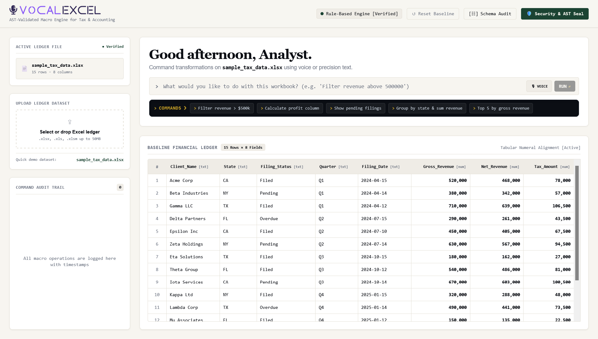
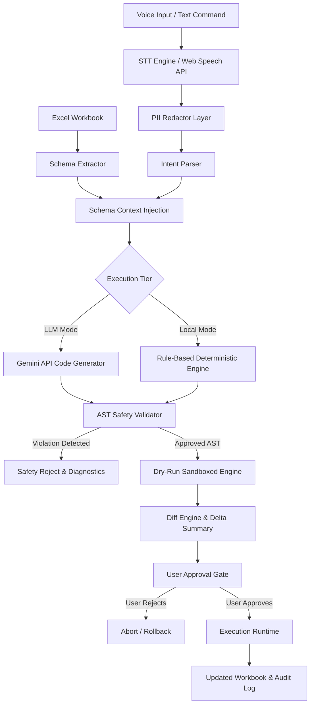
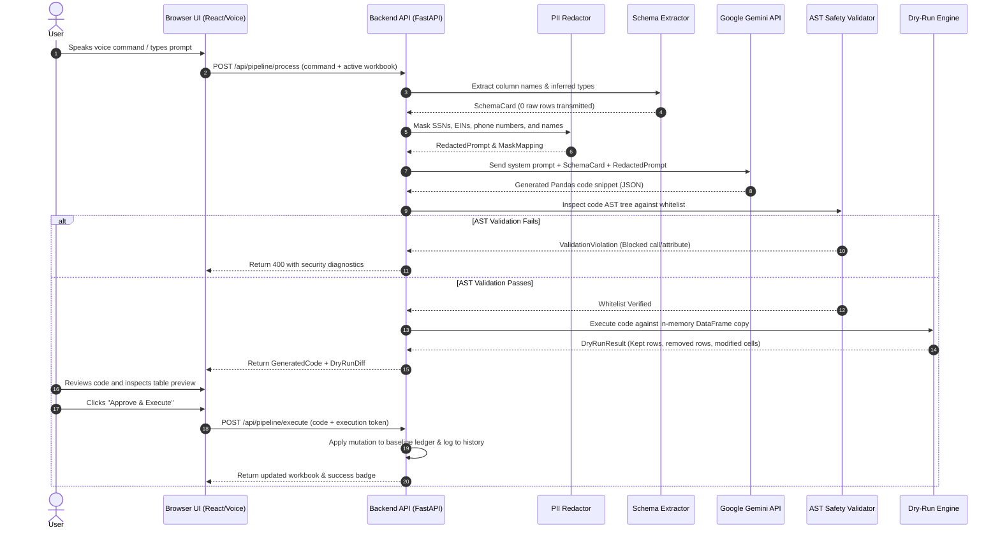

# VOCALEXCEL

An AI-powered, voice-driven Excel macro builder for tax and accounting workflows with AST-enforced safety whitelisting and dry-run diff verification.

[](https://www.python.org/)
[](https://fastapi.tiangolo.com/)
[](https://ai.google.dev/)
[](./LICENSE)
[]()

[Live Demo](YOUR_DEPLOYED_URL_HERE) <!-- Replace YOUR_DEPLOYED_URL_HERE with your deployed app URL -->

---

## Demo Preview

<!-- Screenshot of the command input + AST validation badge and financial ledger preview table -->


---

## The Problem

Tax and accounting professionals spend dozens of hours every tax season manually manipulating client workbooks (e.g., filtering overdue filings, recalculating tax liabilities, and segmenting quarterly revenues) because writing custom VBA macros requires software engineering expertise. Generic LLM code assistants are unsafe for financial workflows because they execute arbitrary Python scripts with full filesystem access, risking data corruption, silent formula errors, and unauthorized exposure of client PII to external cloud services.

---

## Key Features

- 🎙️ **Voice & Precision Text Input**: Transcribes spoken commands via client-side Web Speech API without storing audio payloads.
- 🛡️ **AST Safety Whitelist**: Validates generated code using Python's static Abstract Syntax Tree parser against an explicit whitelist of safe Pandas/NumPy operations, rejecting all imports, file I/O, `eval()`, `exec()`, and OS system calls.
- 🔒 **Client-Side PII Redaction**: Scans transcripts and workbook headers to mask SSNs, EINs, emails, phone numbers, and bank account identifiers before sending prompts to the LLM.
- 📊 **Zero-Data Schema Transmission**: Sends only table structure, column headers, and inferred data types to the Gemini API—never raw rows or client financial values.
- ⚡ **Dry-Run Diff Simulation**: Executes proposed transformations in an isolated in-memory sandbox and generates a row-by-row before/after diff with delta counters prior to mutation.
- ✍️ **Human-in-the-Loop Approval**: Guarantees that no workbook modifications are finalized until the operator inspects and confirms the generated code and dry-run preview.
- 📜 **Immutable Audit Trail**: Logs timestamped records of every prompt, generated code block, AST signature, and row delta for compliance verification.
- 🔄 **Deterministic Rule-Based Fallback**: Executes common accounting routines (filtering, sorting, profit calculation, status aggregation) locally when offline or when no API key is supplied.

---

## System Architecture



The execution flow begins when a user speaks or types a command into the **STT Engine / Web Speech API**. The transcript is scrubbed of sensitive identifiers by the **PII Redactor Layer** and normalized by the **Intent Parser**. Concurrently, the **Schema Extractor** inspects the loaded Excel workbook and performs **Schema Context Injection** (transmitting only column headers and data types, omitting raw rows). The prompt routes to either the **Gemini API Code Generator** or the offline **Rule-Based Deterministic Engine**. The output must pass through the **AST Safety Validator**, which denies any non-whitelisted function call. Validated code executes inside the **Dry-Run Sandboxed Engine**, producing an isolated before/after preview in the **Diff Engine & Delta Summary**. Finally, the **User Approval Gate** requires explicit confirmation before the **Execution Runtime** commits changes to the workbook and records the operation in the **Audit Log**.

---

## Tech Stack

| Layer | Technology | Purpose |
| :--- | :--- | :--- |
| **Frontend UI** | React 18, Tailwind CSS, Vanilla JS | Financial ledger dashboard, terminal command palette, and reactive table diffs |
| **Backend API** | FastAPI (Python 3.10+), Uvicorn | Asynchronous REST & WebSocket pipeline server |
| **AI / LLM** | Google Gemini API (`google-generativeai`) | Schema-aware natural language to Pandas code generation |
| **AST Security** | Python `ast` Module | Static analysis whitelist validation blocking unauthorized sys/file calls |
| **Data Engine** | Pandas, OpenPyXL, NumPy | In-memory spreadsheet transformations and Excel workbook I/O |
| **Audio Capture** | Web Speech API | Client-side speech-to-text transcription without external audio storage |

---

## Getting Started

### Prerequisites

- Python 3.10 or higher
- Google Gemini API key ([Get an API key from Google AI Studio](https://aistudio.google.com/))

### Installation

<!-- Step 1: Clone the repository -->
```bash
git clone https://github.com/YOUR_USERNAME/Voice-Activated-Excel-Macro-Builder.git
cd Voice-Activated-Excel-Macro-Builder
```

<!-- Step 2: Create and activate a Python virtual environment -->
```bash
python -m venv venv
# On macOS/Linux:
source venv/bin/activate
# On Windows (PowerShell):
.\venv\Scripts\Activate.ps1
```

<!-- Step 3: Install required backend dependencies -->
```bash
pip install -r backend/requirements.txt
```

<!-- Step 4: Export your Gemini API key -->
```bash
# On macOS/Linux:
export GEMINI_API_KEY="your-gemini-api-key-here"
# On Windows (PowerShell):
$env:GEMINI_API_KEY="your-gemini-api-key-here"
```

<!-- Step 5: Start the FastAPI application server -->
```bash
python -m uvicorn backend.main:app --host 0.0.0.0 --port 8000 --reload
```

<!-- Step 6: Access the application in your browser -->
Navigate to `http://localhost:8000` to launch the VOCALEXCEL interface.

---

## Project Structure

<details>
<summary>View full structure</summary>

```
Voice-Activated-Excel-Macro-Builder/
├── backend/
│   ├── __init__.py                 # Backend package initializer
│   ├── main.py                     # FastAPI application entry point, API routes & static file serving
│   ├── requirements.txt            # Python dependencies (FastAPI, Pandas, OpenPyXL, Gemini API)
│   ├── core/
│   │   ├── __init__.py             # Core package initializer
│   │   ├── ast_validator.py        # Static AST analysis whitelist engine (blocks unapproved operations)
│   │   ├── code_generator.py       # Prompt construction, Gemini LLM client & rule-based fallback
│   │   ├── dry_run_engine.py       # Sandboxed Pandas execution engine for preview diff generation
│   │   ├── execution_runtime.py    # Final in-memory workbook modifier and state committer
│   │   ├── intent_parser.py        # Natural language intent & entity extraction
│   │   ├── pii_redactor.py         # Regex and entity-based PII mask engine (SSN, EIN, Account numbers)
│   │   └── schema_extractor.py     # Excel workbook inspection and schema card constructor
│   ├── models/
│   │   ├── __init__.py             # Models package initializer
│   │   └── schemas.py              # Pydantic data schemas for API requests, responses, and AST diagnostics
│   └── utils/
│       ├── __init__.py             # Utils package initializer
│       └── diff_engine.py          # Row-level before/after diff generator for tabular data
├── frontend/
│   ├── index.html                  # Single-page application entry point
│   ├── css/
│   │   ├── animations.css          # CSS transition and micro-interaction keyframes
│   │   ├── components.css          # Reusable UI component styling
│   │   └── main.css                # Design system tokens (typography, colors, ledger grid layout)
│   └── js/
│       ├── api.js                  # Frontend HTTP client wrapper for backend API endpoints
│       ├── app.js                  # Core application bootstrapper
│       ├── app.jsx                 # Main React component (Ledger Table, Command Bar, Audit Trail)
│       ├── code-display.js         # Syntax-highlighted code viewer with AST inspection details
│       ├── diff-viewer.js          # Tabular diff rendering component
│       ├── pipeline.js             # Real-time pipeline stage tracker
│       ├── schema-viewer.js        # Interactive schema and column cardinality drawer
│       └── voice.js                # Web Speech API speech-to-text integration and audio controls
└── README.md                       # Project documentation and developer guide
```

</details>

---

## How It Works (Data Flow)



---

## Security & Guardrails

- **Zero-Data Transmission**: The Gemini API prompt only receives the structural schema card (`column_names`, `dtypes`, `row_count`). Raw financial records, customer entries, and ledger numbers are never transmitted over external network connections.
- **AST Whitelist Enforcement**: Code generation uses a default-deny policy. All node types, call names, and attribute accesses must exist in `ALLOWED_CALLS` (e.g., `groupby`, `loc`, `sum`, `query`). Banned operations (`__import__`, `open`, `eval`, `exec`, `os`, `sys`, `socket`, `subprocess`) trigger instant rejection before compilation.
- **Isolated Dry-Run Sandboxing**: Every transformation runs on a cloned `DataFrame.copy()` with strict runtime timeouts (default: 5.0 seconds). Memory allocations and cell mutations are inspected before the real dataset is updated.
- **Mandatory Human-in-the-Loop Gate**: Code execution requires explicit client confirmation. The interface presents a visual diff breakdown and requires an `Approve & Execute` trigger to prevent unintended spreadsheet state mutations.

---

## Roadmap

- [x] **Phase 1: Core Voice-to-Macro Pipeline**
  - [x] Web Speech API integration with voice toggle
  - [x] Schema extraction engine for `.xlsx`, `.xls`, `.xlsm`
  - [x] Gemini API code generation with structured JSON output
  - [x] Static AST safety validator with Pandas whitelist
  - [x] In-memory dry-run diff engine with row delta counters
  - [x] Financial ledger dark/light terminal UI with audit trail
- [ ] **Phase 2: Advanced Tax & Accounting Modules**
  - [ ] Multi-sheet relational joins (e.g., W-2 to 1040 reconciliation)
  - [ ] Automatic formula generation (`SUMIF`, `VLOOKUP`, `XLOOKUP`) alongside Pandas code
  - [ ] Support for direct VBA `.bas` export for legacy desktop Excel
- [ ] **Phase 3: Security & Enterprise Governance**
  - [ ] Local offline LLM inference via Ollama / Llama 3
  - [ ] SOC2 / HIPAA compliant encrypted audit log export
  - [ ] Role-based access control (Analyst vs. Senior Partner approval gates)
- [ ] **Phase 4: Integrations & Add-ins**
  - [ ] Microsoft 365 Excel Office Add-in (Web/Desktop)
  - [ ] Direct export to Google Sheets via OAuth API

---

## Contributing

Contributions, bug reports, and feature suggestions are welcome.

1. Fork the repository
2. Create a feature branch (`git checkout -b feature/tax-rule-expansion`)
3. Commit your changes (`git commit -m "feat: add quarter-end reconciliation macro template"`)
4. Push to the branch (`git push origin feature/tax-rule-expansion`)
5. Open a Pull Request

---

## License

This project is open-source and licensed under the [MIT License](./LICENSE).

---
